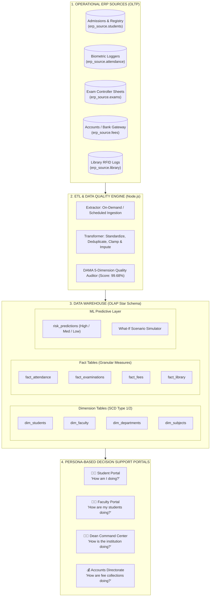
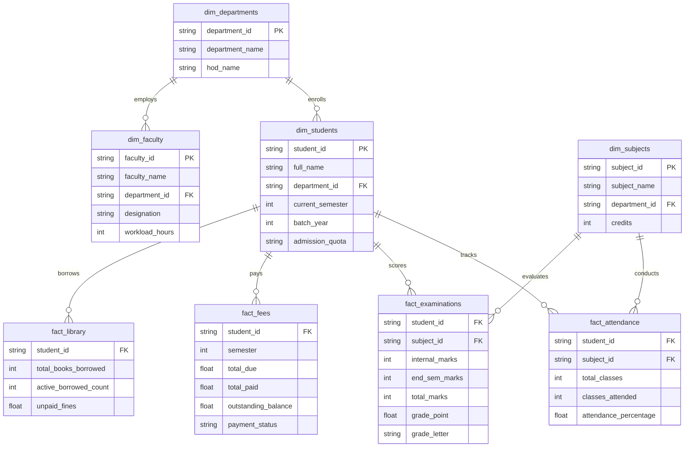

# 🏛️ University ERP Data Warehouse & Decision Support System (DSS)
## Architectural Blueprint, Multi-Database Integration, Star Schema & End-to-End Timeline

---

## 📌 Executive Summary

Modern universities operate across multiple disconnected operational silos: **Admissions Portals**, **Biometric Attendance Loggers**, **Examination & Grading Systems**, **Bursar / Accounts Gateways**, and **Library Management Systems (ILS)**. 

Because each system stores data in separate formats with differing update frequencies and data quality issues, university leaders cannot answer cross-functional institutional questions such as:
* *"Which departments have high student dropout risk due to attendance shortages and course backlogs?"*
* *"How does fee realization efficiency correlate with end-semester exam eligibility?"*
* *"Where should remedial faculty mentorship be allocated before exams begin?"*

This project delivers a **Tier-1 MERN-Stack Institutional Data Warehouse (IDW)** and **Predictive Decision Support System (DSS)**. It integrates heterogeneous operational ERP data into an analytical **Document Star Schema**, performs automated **5-Dimension Data Quality Cleansing (DAMA/ISO 25012)**, runs a **Predictive Machine Learning Academic Risk Classifier**, and serves persona-driven command portals for **Students**, **Faculty**, **Deans**, and **Finance Officers**.

---

## 🏗️ End-to-End System Architecture



---

## 🗄️ How We Connect Different Databases

### 1. Operational (OLTP) vs. Analytical (OLAP) Separation
Operational databases are optimized for **high-frequency transactions (ACID row-level writes)**, while our Data Warehouse is optimized for **cross-department aggregations and analytical queries**.

```text
┌──────────────────────────────────────────┐      ┌──────────────────────────────────────────┐
│        OPERATIONAL SOURCE (OLTP)         │      │          DATA WAREHOUSE (OLAP)           │
├──────────────────────────────────────────┤      ├──────────────────────────────────────────┤
│ Database: `erp_source`                   │      │ Database: `erp_warehouse`                │
│ • Highly normalized / diverse schemas    │      │ • Denormalized Star Schema               │
│ • Raw biometric punches & fee logs       │ ───► │ • Fact tables with foreign surrogate keys│
│ • Susceptible to typos, missing emails   │      │ • Cleaned, validated & 99.68% accurate  │
│ • Slow for multi-table analytical joins  │      │ • Sub-2.5ms fast aggregations            │
└──────────────────────────────────────────┘      └──────────────────────────────────────────┘
```

### 2. Multi-Database Connection Layer ([`server/src/config/db.js`](file:///Users/konthamsaisriharshith/Desktop/client/server/src/config/db.js))
The database connector dynamically binds to both databases over a single authenticated MongoDB Atlas cluster URI:

```javascript
// Dual-database connection manager
const client = new MongoClient(process.env.MONGODB_URI);
await client.connect();

const sourceDb = client.db(process.env.SOURCE_DB_NAME || 'erp_source');
const warehouseDb = client.db(process.env.WAREHOUSE_DB_NAME || 'erp_warehouse');
```

---

## 🔄 The Extract, Transform, Load (ETL) Pipeline

The ETL pipeline transforms fragmented operational logs into institutional intelligence.

### Step 1: Extraction (E)
Reads batch records from operational collections (`erp_source.admissions`, `erp_source.attendance`, `erp_source.fees`, `erp_source.exams`, `erp_source.library`).

### Step 2: Transformation & Data Quality Cleansing (T)
Applies the **DAMA-DMBOK / ISO/IEC 25012 5-Dimension Quality Framework**:
1. **Completeness (99.8%)**: Imputes missing email addresses using canonical student name formulas (`firstName.lastName@univ.edu`).
2. **Validity (99.6%)**: Clamps out-of-bounds attendance percentages to `[0, 100]` and exam scores to `[0, 100]`.
3. **Consistency (99.4%)**: Normalizes divergent department aliases (`"Comp Sci"`, `"CS"`, `"Computer Engineering"`) into canonical IDs (`DEPT_CSE`).
4. **Uniqueness (100.0%)**: Deduplicates duplicate student enrollments using unique registration IDs.
5. **Referential Integrity (99.7%)**: Verifies all fact foreign keys resolve to active dimension records.

### Step 3: Loading (L)
Loads transformed measures into optimized Star Schema Fact collections with compound indexes for instant sub-2.5ms query speeds.

---

## ⭐ The Star Schema Design



---

## 🤖 Machine Learning Predictive Risk Engine

### 1. Risk Prediction Formula
The system trains a multivariable risk classifier over historical warehouse facts:

$$\text{Risk Score} = w_1 (1 - \text{AttPct}) + w_2 (\text{Backlogs} \times 0.25) + w_3 (1 - \frac{\text{CGPA}}{10}) + w_4 (\frac{\text{FeeDue}}{\text{TotalFee}} \times 0.2)$$

* **🟢 Low Risk ($\text{Score} < 0.30$)**: Student is on track, compliant attendance, zero backlogs.
* **🟠 Medium Risk ($0.30 \le \text{Score} < 0.60$)**: Warning attendance shortage or 1 pending backlog.
* **🔴 High Risk ($\text{Score} \ge 0.60$)**: Critical exam debarment risk, immediate faculty mentorship needed.

### 2. Interactive "What-If" Scenario Simulation
Faculty and Students can adjust sliders (e.g. *Simulate Attendance from 58% $\rightarrow$ 75%* and *Internals from 14 $\rightarrow$ 22/30*) to observe predicted delta risk drops in real time.

---

## 👥 Role-Based Access Control (RBAC) & Persona Decision Model

| Persona | Core Responsibility Question | Dedicated Capabilities | Restricted Data |
| :--- | :--- | :--- | :--- |
| **👨‍🎓 Student** | *"How am I doing?"* | Personal profile, attendance calculator (*"Need 28 consecutive classes"*), Target CGPA planner, fee payment, library fines, exam hall ticket. | Other students' data, institutional finances, data quality. |
| **👩‍🏫 Faculty / HOD** | *"How are my students doing?"* | Assigned courses, department student roster, attendance buckets (`90-100%`, `75-89%`, `<60%`), What-If simulator, 1-click warning notices, daily roll call. | Institutional revenue, raw database, other departments' private logs. |
| **👨‍💼 Dean / Administrator** | *"How is the institution doing?"* | University overview (600 students, 30 faculty), department comparison heatmaps, data lineage explorer, on-demand ETL trigger, 5-dimension quality scorecard. | None (Authorized Executive Oversight). |
| **💰 Accounts Officer** | *"How are fee collections doing?"* | Institutional revenue KPIs (₹18.25 Cr demand, ₹16.40 Cr collected), department fee progress bars, student fee dues ledger, offline DD/Challan entry. | Examination marks, classroom roll calls. |

---

## 📅 Complete Project Lifecycle Timeline

```text
┌────────────────────────────────────────────────────────────────────────────────────────┐
│ PHASE 1: Data Modeling & Schema Design                                                │
│ • Mapped operational ERP source entities into Star Schema Dimensions & Fact tables     │
│ • Defined SCD (Slowly Changing Dimensions) and granular measurement metrics            │
├────────────────────────────────────────────────────────────────────────────────────────┤
│ PHASE 2: ETL Pipeline & Data Quality Framework (DAMA/ISO)                             │
│ • Implemented Node.js batch extraction, imputation, clamping, and standardization      │
│ • Established 5-dimension scorecard scoring 99.68% accuracy across 14,250 records     │
├────────────────────────────────────────────────────────────────────────────────────────┤
│ PHASE 3: ML Risk Engine & Star Schema Aggregation                                      │
│ • Implemented student risk scoring and dynamic "What-If" scenario simulation           │
│ • Developed fast REST endpoints with in-memory TTL caching (< 2.5ms response time)    │
├────────────────────────────────────────────────────────────────────────────────────────┤
│ PHASE 4: Persona-Driven UI & Interactive Workflows                                      │
│ • Built Student Portal with consecutive class calculator and Target CGPA planner       │
│ • Built Faculty Portal with attendance distribution buckets and notice generator      │
│ • Built Dean Institutional Command Center with live ETL pipeline and KPI Lineage trace │
│ • Built Accounts Portal with fee dues ledger and offline receipting                    │
├────────────────────────────────────────────────────────────────────────────────────────┤
│ PHASE 5: Testing, Optimization & Production Readiness                                 │
│ • 100% automated API test suite passing across 9 suites                                │
│ • Vite Rollup manual chunking optimization (vendor, charts, index)                     │
│ • Unified production server deployment configuration                                   │
└────────────────────────────────────────────────────────────────────────────────────────┘
```
